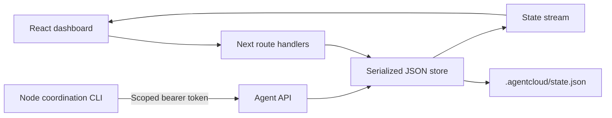

# AgentCloud architecture

## Current executable boundary

AgentCloud is a React / Next.js App Router application with Node.js route handlers, a durable JSON store, an SSE event stream, and a Node CLI. It is a **single-user development prototype intended to bind to loopback**. The dashboard APIs are unauthenticated. Do not deploy this build as a public multi-user service.

The product coordinates multiple identities around tasks, registered services, and structured handoffs. Fresh storage starts with an empty project list. There are no bundled project fixtures or replay actions; the supplied reference exports provide visual inspiration only.

Projects persist metadata. A generated token lets an external process connect to the real coordination API, heartbeat, read project context, update its own tasks, register an HTTP endpoint, and publish a handoff. This client does not launch Codex or Claude, execute commands, provision compute, create Git worktrees, or forward ports. A branch on a newly registered identity is a planned branch name. Service registration reports `registered`, not verified health. SSH input is saved configuration, not a verified connection.

`lib/workspace.ts` now provides an isolated **local** Git implementation that can clone a credential-free HTTPS repository, create per-agent worktrees, and inspect their on-disk identity. Its tests use a temporary repository; no fixture is bundled into application state. This provider is not yet connected to project setup, API actions, CLI commands, or the dashboard. A saved project therefore still represents metadata only, and no remote execution is implied.

## Target client responsibilities

The desktop app owns task creation, instructions, agent assignment, and follow-ups. The web app owns project/environment configuration, access and resource management, operational analytics, and viewing progress/results. Both consume the same authenticated backend records; the desktop app does not keep a separate authoritative task store. Environment attachment/allocation requests are project-scoped and can precede task creation. After the machine is verified, the desktop app creates a task and requests an agent start against that environment. The server checks permission at both stages. A ready environment can have zero agent runs; connecting a machine does not start an agent.

This is a target responsibility split. The current web task controls, human task mutation API, and handoff acceptance behavior remain implemented until migrated. Moving authoring includes follow-up task creation through handoffs; do not silently remove the shared backend task contract. Analytics must derive from persisted run events or explicit telemetry and identify missing data.

## Components and data flow

`lib/types.ts` defines the shared public contract. Initial state contains no projects. `lib/store.ts` validates domain operations and owns disk writes. `lib/http.ts` handles bounded JSON requests and browser-origin validation. The CLI has no external runtime dependencies beyond Node with built-in fetch.

## Proposed remote-backend shape

[BACKEND_PLAN.md](BACKEND_PLAN.md) is the implementation contract for the next backend slices. It proposes one transactional control-plane database, a job/outbox-backed worker, provider-specific box adapters, and replayable run events. None of those components is deployed in the current app.

| Boundary | Planned responsibility | Explicit limit |
| --- | --- | --- |
| Authenticated API | Employee sessions, project membership, requests, policy decisions, scoped reads/writes | Current human routes are unauthenticated |
| Transactional store | Decisions, jobs, box identities, runs, events, and idempotent transitions | Current JSON queue protects only one Node process |
| Run-box worker | Claim approved jobs, call a provider, verify outcomes, reconcile drift | Never accept an arbitrary browser command as a provisioning job |
| Provider adapter | Attach an existing SSH host or launch/stop EC2 using the same lifecycle contract | A stored hostname or EC2 API success is not a ready run box |
| Remote runner | Start the actual agent and workload, emit bounded attributed events | Heartbeat and model execution are distinct |
| Event stream | Snapshot plus replay cursor after reconnect | Current SSE sends whole local-state snapshots and has no durable cursor |

For the managed path, EC2 is the first proposed cloud provider. A known SSH GPU host remains the quickest proof path if it is available. Both paths must verify the execution identity, workspace, GPU operation, and stop result. AWS Systems Manager may provide management access without inbound SSH, but IAM access to the instance does not establish file or command restrictions inside an agent's shell. [AWS Session Manager](https://docs.aws.amazon.com/systems-manager/latest/userguide/session-manager.html)

## Routes

| Route | Behavior |
| --- | --- |
| `GET /api/state` | Current public state; never includes credential hashes |
| `POST /api/state` | Human project/task/agent/handoff actions |
| `POST /api/actions` | Alias of the human mutation endpoint |
| `GET /api/events` | Default SSE messages containing complete state on state changes, including heartbeat expiry; comments keep connection alive |
| `POST /api/agent` | Bearer-scoped `connect`, `heartbeat`, `context`, `task`, `service`, and `handoff` operations |
| `POST /api/resources` | Local-administrator catalog registrations, resource requests, and inference configuration drafts; no allocation or policy approval |

Human mutations accept `{type, projectId, ...fields}` and return `{state, ...result}`. Creating a project returns `id`; creating an agent returns `agentId` and the one-time plaintext `token`. API errors use `{error}` with appropriate 400, 401, 403, 404, or 409 status codes. Internal errors return a generic 500 response.

The resource API accepts `registerResource`, `requestResource`, and `saveInferenceDraft`. It validates bounded fields and same-project task, agent, and resource references. New catalog entries are only `registered`; inference configurations are only `draft`. Requests are only `requested` with a `not_evaluated` decision explaining that employee identity and resource policy are absent. Callers cannot provide approval, allocation, running, or verified state. Older project snapshots load with empty resource arrays. The Runs screen projects existing events and heartbeats; the Graph screen projects persisted relationships. Neither creates execution evidence.

## Persistence and concurrency

`AGENTCLOUD_DATA_DIR` defaults to `.agentcloud` in the working directory. Every successful mutation increments the public revision. Mutations run through one process-wide queue, read the latest disk snapshot, validate, then write a unique temporary file and atomically rename it. The directory and files use owner-only creation modes. Failed validation does not persist partial changes. The UI receives updated snapshots over SSE, sampled once per second. A 45-second heartbeat timeout derives disconnected status for agents without writing to disk. Events retain the latest 500 entries per project.

This protects concurrent requests **within one Node process**. It is not a distributed lock, transactional database, durability guarantee against power loss, or multi-instance deployment architecture. Use one local server process. State survives process restarts; deleting the data directory resets it. The initial empty state is materialized on the first successful operation.

## Trust and access enforcement

Tokens are cryptographically random and stored as SHA-256 hashes. Every agent operation resolves project and identity from its credential. Supplied mismatched project or identity identifiers are denied. Agents can update only their owned tasks and cannot start/finish dependent tasks before the prerequisite is complete. Handoffs must target an identity in the same project. Registered service URLs must use HTTP or HTTPS. Unsupported operations, including shell commands, are denied.

The credential grants project-wide context read access. There is no claimed filesystem sandbox, path-level enforcement, remote shell permission model, encryption of saved state, token rotation/revocation UI, resource approval enforcement, or per-user authentication. The human dashboard is trusted local administration and can reassign task status. Accepting a handoff idempotently assigns a queued follow-up to its recipient, or reuses that recipient’s matching active task. Project creation accepts HTTPS repository URLs without embedded credentials and the two supported compute choices; SSH metadata requires a valid hostname or user@hostname. Browser origin checks compare against the browser-facing `Host` header (falling back to the request URL) and `x-forwarded-proto` (falling back to the URL protocol), so Next.js internal hostname normalization does not reject a local same-origin request. Any reverse proxy must overwrite forwarded protocol headers; this local prototype does not establish a general trusted-proxy boundary. Cross-origin browser mutation requests are denied, but this is not a replacement for authentication. The CLI requires HTTPS for non-loopback server connections. It never prints the bearer token.

Connection status reflects the most recent heartbeat; identities are shown as disconnected after 45 seconds without a heartbeat. Endpoints are metadata supplied by clients and are not fetched by the server.

The intended remote architecture keeps development endpoints inside an organization-private workspace network and limits discovery to authorized project agents and members. The current registry only validates HTTP(S) URLs: it does not provide private ingress, enforce an organization network boundary, or prevent a client from registering a public URL. Do not describe registered services as private until those controls are implemented and tested.

## Road to the governed remote MVP

The HackGT MVP is now a governed single-agent GPU run, specified in [MVP_SPEC.md](MVP_SPEC.md). The first remote-computer milestone is to attach to a user-controlled Linux host, verify its identity, and create or attach a real run environment there. A GPU may be on that host or on a separate SSH resource target reachable from it. Verify task-critical access from the agent's actual execution environment; this is not proof that AgentCloud procured or isolated a GPU. The control plane records intended targets separately from verified connections and completed work.

The planned path is employee OIDC login → server-side resource policy → provisioner → identified remote run environment → actual agent/command event stream → authenticated control surface. The box performs the work; the web app displays what the remote runner reports and what the server verifies. One real agent adapter and one known GPU host are enough for the MVP. Employee, agent session, and remote execution identities must remain distinct. The current JSON store and unauthenticated human routes do not provide these properties. [BACKEND_PLAN.md](BACKEND_PLAN.md) defines separate request, box, run, and GPU-verification state machines.

1. Add transactional decision/job/run storage, one employee identity-provider integration, project roles, server-side sessions, and authenticated human APIs. Keep the existing JSON state readable during migration. Do not enable multi-user access on the current unauthenticated JSON API.
2. Add a run-box worker that first attaches a known Linux host, then implements EC2 as the first managed provider behind the same contract. Validate repository URLs, clone safely, and record machine, account, and worktree identity. Keep provider/model credentials separate from remote execution credentials.
3. Launch one real agent adapter on that environment and stream bounded command/session events. Verify the GPU workload and one authorized/denied resource action at the actual SSH or execution boundary. Treat unrestricted SSH as trusted access.
4. Add a second independent agent and private development service discovery, then artifact homes with independent storage and serving lifecycles. See [FEATURE_SPEC.md](FEATURE_SPEC.md) for temporary-service and publication behavior.
5. Add integration review, diffs, explicit merges, and stronger execution-boundary restrictions where needed. Enforce approvals, expiry, budgets, and any advertised access restrictions at the boundary that controls the resource.

The planned desktop app owns the task-authoring workflow and may reuse the CLI transport and remote adapters. Its task creation integration is required for the target user journey; it should not duplicate project state or backend coordination logic. The web app sets up environments and monitors analytics and progress.

## Verification

`npm test` exercises the current local persistence and resource records, simultaneous writes, cross-project/identity denial, task ownership, dependency enforcement, cross-agent discovery and handoffs, unsupported execution denial, URL validation, credential redaction, and request validation. These tests do not verify employee login, provider calls, or remote GPU execution. Production build/type checks and browser UI checks are separate verification layers.
