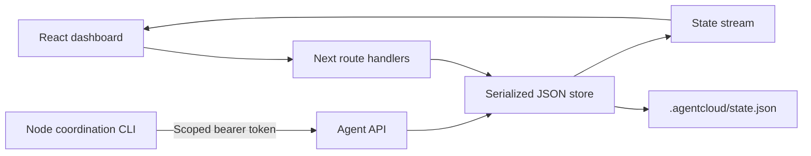

# AgentCloud architecture

## Current executable boundary

AgentCloud is a React / Next.js App Router application with Node.js route handlers, a durable JSON store, an SSE event stream, and a Node CLI. It is a **local organization-aware demo intended to bind to loopback**. Human dashboard/API access requires a Better Auth cookie session and project membership. Do not deploy this build as a public multi-user service.

The product coordinates multiple identities around tasks, registered services, and structured handoffs. Fresh storage starts with an empty project list. There are no bundled project fixtures or replay actions; the supplied reference exports provide visual inspiration only.

Projects persist metadata. A generated token lets an external process connect to the real coordination API, heartbeat, read project context, update its own tasks, register an HTTP endpoint, and publish a handoff. This client does not launch Codex or Claude, execute commands, provision compute, create Git worktrees, or forward ports. A branch on a newly registered identity is a planned branch name. Service registration reports `registered`, not verified health. SSH input is saved configuration, not a verified connection.

`lib/workspace.ts` now provides an isolated **local** Git implementation that can clone a credential-free HTTPS repository, create per-agent worktrees, and inspect their on-disk identity. Its tests use a temporary repository; no fixture is bundled into application state. This provider is not yet connected to project setup, API actions, CLI commands, or the dashboard. A saved project therefore still represents metadata only, and no remote execution is implied.

## Target client responsibilities

The desktop app owns task creation, instructions, agent assignment, and follow-ups. The web app owns project/environment configuration, access and resource management, operational analytics, and viewing progress/results. Both consume the same authenticated backend records; the desktop app does not keep a separate authoritative task store. Environment attachment/allocation requests are project-scoped and can precede task creation. After the machine is verified, the desktop app creates a task and requests an agent start against that environment. The server checks permission at both stages. A ready environment can have zero agent runs; connecting a machine does not start an agent.

This is a target responsibility split. The current web task controls, human task mutation API, and handoff acceptance behavior remain implemented until migrated. Moving authoring includes follow-up task creation through handoffs; do not silently remove the shared backend task contract. Analytics must derive from persisted run events or explicit telemetry and identify missing data.

## Components and data flow

`lib/types.ts` defines the shared public contract. Initial state contains no projects. `lib/store.ts` validates domain operations and owns disk writes. `lib/http.ts` handles bounded JSON requests and browser-origin validation. The CLI has no external runtime dependencies beyond Node with built-in fetch.

## Proposed remote-backend shape

[BACKEND_PLAN.md](BACKEND_PLAN.md) is the implementation contract for the next backend slices. It proposes one transactional control-plane database, a job/outbox-backed worker, provider-specific box adapters, and replayable run events. None of those components is deployed in the current app.

| Boundary | Planned responsibility | Explicit limit |
| --- | --- | --- |
| Authenticated API | Employee sessions, project membership, requests, policy decisions, scoped reads/writes | Sessions and membership implemented locally; resource decision policies remain planned |
| Transactional store | Decisions, jobs, box identities, runs, events, and idempotent transitions | Current JSON queue protects only one Node process |
| Run-box worker | Claim approved jobs, call a provider, verify outcomes, reconcile drift | Never accept an arbitrary browser command as a provisioning job |
| Provider adapter | Attach an existing SSH host or launch/stop EC2 using the same lifecycle contract | A stored hostname or EC2 API success is not a ready run box |
| Remote runner | Start the actual agent and workload, emit bounded attributed events | Heartbeat and model execution are distinct |
| Event stream | Snapshot plus replay cursor after reconnect | Current SSE sends whole local-state snapshots and has no durable cursor |

For the managed path, EC2 is the first proposed cloud provider. A known SSH GPU host remains the quickest proof path if it is available. Both paths must verify the execution identity, workspace, GPU operation, and stop result. AgentCloud AWS resources are defined and managed in [Terraform](infra/aws/); the current foundation has a launch template and expiry guard but no deployed run box or EC2 worker. AWS Systems Manager may provide management access without inbound SSH, but IAM access to the instance does not establish file or command restrictions inside an agent's shell. [AWS Session Manager](https://docs.aws.amazon.com/systems-manager/latest/userguide/session-manager.html)

## Routes

| Route | Behavior |
| --- | --- |
| `GET /api/state` | Session-required, membership-filtered state; never includes credential hashes |
| `POST /api/state` | Human project/task/agent/handoff actions |
| `POST /api/actions` | Alias of the human mutation endpoint |
| `GET /api/events` | Default SSE messages containing complete state on state changes, including heartbeat expiry; comments keep connection alive |
| `POST /api/agent` | Bearer-scoped `connect`, `heartbeat`, `context`, `task`, `service`, and `handoff` operations |
| `GET/POST /api/run-boxes` | List a project's environments (state, `ssh`, `desktopUrl`, `workspacePath`, `agent.codex`) and imported local container `templates`, or create one in one step for a server-owned profile or an imported `local-template:<id>` profile (owner approved, member denied). `ssh` and `desktopUrl` are null once a stop is requested |
| `POST /api/run-boxes/:id/stop` | Owner stop request; the worker tears the environment down |
| `GET/POST /api/ssh-keys`, `DELETE /api/ssh-keys/:id` | The caller's device public keys (ed25519 only); private keys never reach the server. The docker-local and Runpod workers reconcile running environments' authorized keys after a revocation |
| `GET /api/run-boxes/:id/connection` | For a ready environment: host, port, user and pinned host key. 403 `no_authorized_key` when none of the caller's keys was injected |
| `POST /api/agent-runs`, `GET /api/agent-runs?projectId=`, `GET /api/agent-runs/:id`, `POST /api/agent-runs/:id/events`, `POST /api/agent-runs/:id/finish` | Agent run records and bounded, sequence-idempotent events, for the Runs page |
| `POST /api/chat` | Employee session project chat; provisions/binds `desktop-chat` agent identity; streams model tokens server-side (`OPENAI_API_KEY`); never returns model or agent plaintext secrets |
| `POST /api/resources` | Verified project-member catalog registrations, resource requests, and inference configuration drafts; requests record server-derived employee, organization, and project role at submission, with no allocation or policy approval |

Human mutations accept `{type, projectId, ...fields}` and return `{state, ...result}`. Creating a project returns `id`; creating an agent returns `agentId` and the one-time plaintext `token`. API errors use `{error}` with appropriate 400, 401, 403, 404, or 409 status codes. Internal errors return a generic 500 response.

`addTask` accepts optional `runBoxId` for a project run-box job whose persisted state is `ready` and has no stop request. The server resolves this ID in SQLite and rejects missing, cross-project, or inactive jobs. The legacy verified catalog `environmentId` remains supported; callers choose one binding. This records task intent only and does not start an agent or guarantee the box will remain ready after creation. The route requires project membership before the store validates the binding.

The resource API accepts `registerResource`, `requestResource`, and `saveInferenceDraft`. It validates bounded fields and same-project task, agent, and resource references. New catalog entries are only `registered`; inference configurations are only `draft`. Requests are only `requested` with a `not_evaluated` decision explaining that resource policy is absent. Callers cannot provide approval, allocation, running, or verified state. Older project snapshots load with empty resource arrays. The Runs screen projects existing events and heartbeats; the Graph screen projects persisted relationships. Neither creates execution evidence.

## Environments, SSH access, and Codex

Environments are run-box jobs in the auth SQLite database (`run_box_decision`, `run_box_job`, `run_box_transition`). A provider worker (`scripts/run-box-worker.mjs --loop docker-local|runpod`) claims approved jobs, allocates the machine, and marks it `ready` only after verifying SSH. Security properties:
- **Host keys:** each environment gets an ed25519 host key generated by the worker and injected at creation, recorded in `run_box_ssh_endpoint`, and pinned by both the worker and the desktop app. There is no trust-on-first-use.
- **Authorized keys:** fixed at allocation from the project members' registered device keys (`employee_ssh_key`). A key registered later is not present on an existing environment.
- **Account:** the box account is non-root (`agentcloud`). Access is trusted shell access.
- **Runpod key pin override:** an operator pin in `known_hosts` (`scripts/runpod-pin-host-key.mjs`) overrides the injected key.
- **Runpod local mode:** `AGENTCLOUD_RUNPOD_LOCAL=1` runs the worker from a developer machine, guarded by a separate watchdog process.

Codex (Stage 2, [docs/stage2-contract.md](docs/stage2-contract.md)):
- **Install:** every environment image or start script installs Codex CLI 0.157.1, tmux and Node 22, and sets `cli_auth_credentials_store = "file"`.
- **Agent check:** after SSH verification the worker records `codex --version` in `run_box_agent_check`. SSH readiness and agent readiness are separate facts.
- **Workspace:** the workspace path is recorded in `run_box_workspace`.
- **Teardown:** before destroying a box, the worker runs `codex logout`, removes `~/.codex/auth.json` and AgentCloud scratch files, and logs each step in `run_box_cleanup_log`. A cleanup failure never blocks teardown.
- **Sign-in:** Codex signs in per employee inside the box, with ChatGPT device sign-in preferred and a copied local login as a fallback. The server stores no OpenAI key.

## Persistence and concurrency

`AGENTCLOUD_DATA_DIR` defaults to `.agentcloud` in the working directory. Every successful mutation increments the public revision. Mutations run through one process-wide queue, read the latest disk snapshot, validate, then write a unique temporary file and atomically rename it. The directory and files use owner-only creation modes. Failed validation does not persist partial changes. The UI receives updated snapshots over SSE, sampled once per second. A 45-second heartbeat timeout derives disconnected status for agents without writing to disk. Events retain the latest 500 entries per project.

This protects concurrent requests **within one Node process**. It is not a distributed lock, transactional database, durability guarantee against power loss, or multi-instance deployment architecture. Use one local server process. State survives process restarts; deleting the data directory resets it. The initial empty state is materialized on the first successful operation.

## Trust and access enforcement

Tokens are cryptographically random and stored as SHA-256 hashes. Every agent operation resolves project and identity from its credential. Supplied mismatched project or identity identifiers are denied. Agents can update only their owned tasks and cannot start/finish dependent tasks before the prerequisite is complete. Handoffs must target an identity in the same project. Registered service URLs must use HTTP or HTTPS. Unsupported operations, including shell commands, are denied.

The credential grants project-wide context read access. There is no claimed filesystem sandbox, path-level enforcement, remote shell permission model, encryption of saved state, token rotation/revocation UI, resource approval enforcement, or production tenant isolation. The human dashboard requires employee authentication and project membership and can reassign task status. Accepting a handoff idempotently assigns a queued follow-up to its recipient, or reuses that recipient’s matching active task. Project creation accepts HTTPS repository URLs without embedded credentials and the two supported compute choices; SSH metadata requires a valid hostname or user@hostname. Browser origin checks compare against the browser-facing `Host` header (falling back to the request URL) and `x-forwarded-proto` (falling back to the URL protocol), so Next.js internal hostname normalization does not reject a local same-origin request. Any reverse proxy must overwrite forwarded protocol headers; this local prototype does not establish a general trusted-proxy boundary. Cross-origin browser mutation requests are denied, but this is not a replacement for authentication. The CLI requires HTTPS for non-loopback server connections. It never prints the bearer token.

Connection status reflects the most recent heartbeat; identities are shown as disconnected after 45 seconds without a heartbeat. Endpoints are metadata supplied by clients and are not fetched by the server.

The intended remote architecture keeps development endpoints inside an organization-private workspace network and limits discovery to authorized project agents and members. The current registry only validates HTTP(S) URLs: it does not provide private ingress, enforce an organization network boundary, or prevent a client from registering a public URL. Do not describe registered services as private until those controls are implemented and tested.

## Road to the governed remote MVP

The HackGT MVP is now a governed single-agent GPU run, specified in [MVP_SPEC.md](MVP_SPEC.md). The first remote-computer milestone is to attach to a user-controlled Linux host, verify its identity, and create or attach a real run environment there. A GPU may be on that host or on a separate SSH resource target reachable from it. Verify task-critical access from the agent's actual execution environment; this is not proof that AgentCloud procured or isolated a GPU. The control plane records intended targets separately from verified connections and completed work.

The planned path is employee login (local email/password now; OIDC later) → server-side resource policy → provisioner → identified remote run environment → actual agent/command event stream → authenticated control surface. The box performs the work; the web app displays what the remote runner reports and what the server verifies. One real agent adapter and one known GPU host are enough for the MVP. Employee, agent session, and remote execution identities must remain distinct. The current JSON coordination store does not provide transactional run/decision records. [BACKEND_PLAN.md](BACKEND_PLAN.md) defines separate request, box, run, and GPU-verification state machines.

1. Add transactional decision/job/run storage and server-enforced resource policies, building on local employee sessions and project memberships. Keep existing JSON state readable during migration.
2. Add a run-box worker that first attaches a known Linux host, then implements EC2 as the first managed provider behind the same contract. Validate repository URLs, clone safely, and record machine, account, and worktree identity. Keep provider/model credentials separate from remote execution credentials.
3. Launch one real agent adapter on that environment and stream bounded command/session events. Verify the GPU workload and one authorized/denied resource action at the actual SSH or execution boundary. Treat unrestricted SSH as trusted access.
4. Add a second independent agent and private development service discovery, then artifact homes with independent storage and serving lifecycles. See [FEATURE_SPEC.md](FEATURE_SPEC.md) for temporary-service and publication behavior.
5. Add integration review, diffs, explicit merges, and stronger execution-boundary restrictions where needed. Enforce approvals, expiry, budgets, and any advertised access restrictions at the boundary that controls the resource.

The planned desktop app owns the task-authoring workflow and may reuse the CLI transport and remote adapters. Its task creation integration is required for the target user journey; it should not duplicate project state or backend coordination logic. The web app sets up environments and monitors analytics and progress.

## Verification

`npm test` exercises the current local persistence and resource records, simultaneous writes, cross-project/identity denial, task ownership, dependency enforcement, cross-agent discovery and handoffs, unsupported execution denial, URL validation, credential redaction, and request validation. Authentication tests additionally verify login, logout, verified signup, organization invitations and project isolation, persisted sessions across a fresh process, anonymous denial, and employee/agent identity separation. They do not verify provider calls or remote GPU execution. Production build/type checks and browser UI checks are separate verification layers.

## Local employee identity

`lib/auth.mjs` owns Better Auth, the organization plugin, and SQLite. `lib/employee.ts` resolves verified session identity, active organization, and project access. Owners/admins see all projects in their organization; members require explicit assignments. The dashboard checks sessions and active membership server-side. `/api/auth/[...all]` serves Better Auth; `/api/employee` exposes the caller's identity and memberships; `/api/organizations` serves organization management and project assignment; `/api/invitations/[id]` exposes invitation details only to its verified recipient.

`npm run auth:setup` migrates users, sessions, organizations, memberships, invitations, `project_organization`, and delivery records. A SQLite member-delete trigger revokes project assignments both on removal and voluntary departure. New accounts verify email before organization creation or invitation acceptance. Local messages are captured in private files by default; SMTP is optional. See README for setup and limitations.

The web app, API, and Better Auth run together on a self-hosted local install. The shared Doppler `dev` config supplies the auth secret; AWS credentials are not part of the local auth path. Each install has its own SQLite database and coordination data, so a shared secret alone does not make accounts available across installs. The separate AWS deployment runs one shared app and database behind a CloudFront HTTPS URL, which visitors can use without AWS credentials. It has separate data and a separate secret from local installs. An AWS or Runpod SSH host for agent work is a separate compute endpoint. See README for fresh-install commands and local verification links.

JSON still stores coordination data. There is no cross-store transaction: failed project attachment can require administrative repair. Existing legacy projects require explicit owner adoption into an organization. Allocation policy, enterprise SSO, production tenant isolation, and remote execution enforcement remain unimplemented.

## Optional shared-backend frontend preview

`just dev-aws` runs local Next.js UI with `AGENTCLOUD_REMOTE_BACKEND_URL` selected from Doppler's `AGENTCLOUD_URL`. The loopback-only `proxy.ts` API bridge and `lib/page-auth.ts` server-rendered guards use the same remote employee session. API responses, live event streams, and auth cookie changes remain tied to the selected backend. Self-hosted mode stays the default; the preview does not read the local account database or silently fall back to it when AWS is unavailable. Public hosting uses the regular same-origin app deployment, not this development bridge.

## Local Docker simulation

`compose.yaml` builds the real backend as a non-root Node 22 development container, with persistent SQLite/JSON state and captured mail in a named volume. Its generated auth secret stays private in that volume, outside Docker image layers and Terraform state. `just dev-docker` connects the local frontend bridge to loopback port 3002. Remote bridge HTTP is accepted only for literal loopback hosts; other upstreams require HTTPS. `infra/local` is an alternative Docker Terraform root, separate from both AWS roots and never automatically applied. The simulator verifies local application flows, not AWS IAM, EC2 allocation, GPU availability, or agent execution.

The separate `docker-local` run-box worker creates a CPU-only SSH container per approved project environment on its Docker host. The default image includes a pinned Codex CLI but does not start a model process. Imported templates are recorded in the local SQLite database after a temporary-container SSH and tool probe; each record pins a Docker image ID, and the worker runs that identity rather than a mutable tag. The web and worker must share the same data directory and Docker host. AWS VM container hosting, image publication to a registry, and remote SSH routing are not implemented by this path.

## Local Docker Codex integration (HAC-116)

The opt-in local Codex path initializes a real Codex app-server in a Docker CPU
box from project Settings and lets desktop **Project chat** send turns to the same
persistent thread. Project and agent conversation selection live in the shared
sidebar; there is no separate Codex agents tab. Employee membership gates reads and chat; owners control setup and
lifecycle. SQLite stores bounded attributed session items, while the Docker
volume retains Codex history and workspace files. This local implementation does
not satisfy the AWS/GPU execution or public multi-tenant milestones above. See
[LOCAL_CODEX.md](LOCAL_CODEX.md) for setup, authentication, recovery and limits.

## Desktop chat redesign (HAC-154)

The current desktop navigation is Project chat and Environments; Tasks and desktop
task authoring are removed. Backend task records and APIs remain available. Chat
uses real project/agent Codex sessions with searchable history, Markdown/code,
text-context attachments, and per-session in-memory drafts. New chat selects an
existing agent conversation; separate conversation creation/deletion is not an
implemented API. Local Docker execution and ready run-box SSH terminals are
separate contexts. Server redaction remains unchanged, and optional file/handoff
cards require actual backend data. The visible brand is lowercase `alto`; existing
technical identifiers and the `agentcloud://` protocol remain compatible.

## Environment-based Codex interaction

Users give Codex work in desktop Project chat after selecting a ready execution
environment. Website Environments owns allocation and lifecycle; Settings does
not create standalone local Codex boxes. Docker is a development provider using
the same environment, SSH, sign-in and run-recording path as remote hosts. Existing
legacy app-server data remains retained but is not a product navigation flow.
See [LOCAL_CODEX.md](LOCAL_CODEX.md) for local environment testing.
