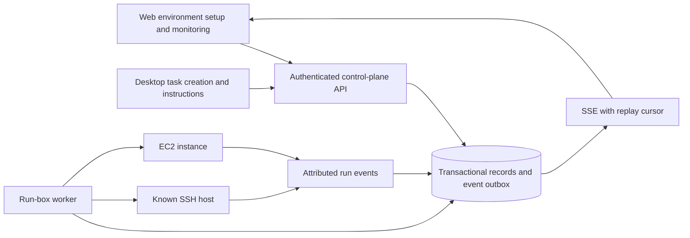

# Backend plan: one governed remote GPU run

This is the proposed implementation contract for the first remote AgentCloud run. It is **not** a description of deployed infrastructure. The current executable boundary is documented in [ARCHITECTURE.md](ARCHITECTURE.md); the user-visible proof is in [MVP_SPEC.md](MVP_SPEC.md).

## Architecture decision

Build one provider-neutral run-box lifecycle. Support an **existing, user-controlled SSH host** as the shortest proof path and **Amazon EC2** as the first managed provider. Use the same request, decision, run, event, and evidence records for both. A known host such as Cresix may be used if access is available; its GPU is existing capacity, not capacity AgentCloud purchased. An EC2 allocation is recorded only after an actual AWS launch succeeds; its run box becomes ready only after execution-environment verification.

For the first EC2 path, prefer one instance per allocated project environment, with at most one active agent run in that environment for the initial demo. This makes instance identity, stop behavior, and attribution easy to inspect. It does not by itself enforce restrictions inside an unrestricted shell. A later scheduler can place multiple runs on shared capacity once isolation, leases, and accounting are real.

The application server remains the **control plane**. A separate worker is the only component permitted to use provider credentials and perform box operations. The box executes the agent and workload and sends bounded, attributed events. The browser never receives AWS credentials, SSH private keys, model credentials, or a direct arbitrary-command capability.



## Client ownership

The desktop app creates tasks, assigns agents, and submits task instructions/follow-ups through the authenticated backend. The web app configures project environments, manages permitted resource lifecycle actions, and reads progress/results and operational analytics. Both use shared project/task/run IDs and server-side authorization. The flow is machine-first: web attachment/allocation requests are project-scoped and do not require a task or agent. The worker verifies the environment independently. The desktop app then creates a task and requests an agent start against the ready box, with a separate server-side authorization decision. A ready box may have zero runs; task completion does not itself release it.

Analytics aggregate recorded run outcomes, durations, failures, and environment state within an explicit time range. Expose freshness and missing data; GPU utilization, token usage, and cost require explicit telemetry sources. Current local coordination snapshots are not evidence that this analytics pipeline or desktop integration exists.

## First durable records

| Record | Minimum fields | Authority |
| --- | --- | --- |
| Employee and membership | Identity-provider subject, project, role, active state | Verified server session and membership table |
| Resource request | Project, requesting employee, environment action, resource/GPU requirement, reason, created time; task and agent optional for initial environment setup | Authenticated API |
| Policy decision | Request, allow/deny, reason, policy version, deciding identity, time | Server-side policy; never browser-supplied |
| Run box | Provider, provider resource ID, project, owner, lifecycle state, remote account, workspace identity, created/stopped times | Worker after provider response |
| Allocation | Request, box, GPU target, lease start/end if enforced, release evidence | Worker after real attachment and release |
| Agent run | Box, task, agent identity, model/session identity, execution state, start/end times | Runner and worker |
| Run event | Run, monotonically increasing sequence, timestamp, actor, kind, bounded detail or output reference | Worker/runner with authenticated attribution |
| Verification | Box/run, probe name, command or method, exit status, device/result summary, time, evidence reference | Worker from a real probe |

The existing JSON project store and `/api/resources` route remain local coordination code. Resource registrations are metadata, requests remain `requested` with `not_evaluated` policy, and inference configurations remain drafts. `auth:setup` creates SQLite decision, job, and transition tables for the local worker contract. The authenticated `POST /api/run-boxes` endpoint now records an owner approval or member denial for an eligible saved G6 request, with one decision per request and an idempotency key; `GET /api/run-boxes?projectId=...` lists scoped jobs, and `POST /api/run-boxes/{id}/stop` records an owner stop request. Approved jobs pin the validated repository URL from the saved project. Project state has no revision field, so the worker must record the full checked-out commit SHA in `repo_revision` before a job can become ready. Existing jobs with no pinned URL cannot pass that ready gate. These SQLite records are the decision and job source of truth; the older JSON request remains a request and is not rewritten as an allocation. An approved job is only queued until a provider worker actually launches and verifies an EC2 instance.

Use a transactional database for employee sessions, decisions, jobs, and run transitions. The local single-worker foundation uses the existing Better Auth SQLite database for atomic decision/job creation, worker leases, and state transitions. PostgreSQL remains the proposed move before distributed workers or production multi-user deployment. A single worker can poll the job table for the MVP; a distributed queue is unnecessary until the load or failure evidence warrants it. Keep database migrations explicit and preserve existing local project records through an import or migration path rather than silently replacing them.

## State transitions and evidence

Keep **request decision**, **box lifecycle**, **agent execution**, and **resource verification** separate:

| State machine | Allowed first-MVP path | Evidence gate |
| --- | --- | --- |
| Request | `requested → approved` or `requested → denied` | Authenticated employee and persisted server policy decision |
| Box | `queued → allocating → connecting → verifying → ready → stopping → stopped`; any active state may enter `failed` | Provider ID for allocation; remote identity and workspace checks for ready; provider confirmation for stopped |
| Agent run | `queued → starting → running → completed/failed/cancelled` | Actual adapter/session start, exit, and timestamped events |
| GPU access | `unverified → visible → workload_verified` or `failed` | Device probe followed by a representative operation inside the agent's execution environment |

An approved request is not an allocated box. An allocated instance is not a ready workspace. A heartbeat is not a running model. `ready` requires the chosen host, account, workspace path, and required GPU operation to be verified and linked to the same box identity. A registered service endpoint remains unverified until a separate server-side health or request check succeeds.

For an attached host, `stopped` means the AgentCloud run environment and its process have stopped; the host's power state is recorded separately. For EC2, record whether the instance is stopped or terminated and whether the workspace volume persists. A retained EBS volume is still billable.

Every transition is idempotent and records actor, time, previous state, new state, and evidence or failure reason. The worker claims a job transactionally; retries use an idempotency key and first inspect the provider before creating another instance. If the worker crashes, reconciliation compares the database record with the actual host/instance and records drift. A failed stop stays visible until provider confirmation; the UI never infers release from a button click.

## Provider contract

The worker should expose a small internal interface, not a browser API:

```ts
interface RunBoxProvider {
  allocate(input: ApprovedRunSpec, idempotencyKey: string): Promise<ProviderBox>;
  inspect(box: ProviderBox): Promise<ObservedBox>;
  verify(box: ProviderBox, requirement: GpuRequirement): Promise<VerificationEvidence>;
  startRun(box: ProviderBox, agent: AgentRunSpec): Promise<RunnerSession>;
  stopRun(session: RunnerSession): Promise<StopEvidence>;
  stopBox(box: ProviderBox): Promise<StopEvidence>;
}
```

`ApprovedRunSpec` describes the approved environment allocation: decision ID, project ID, repository revision or URL, requested capacity, and bounded lifetime intent. Task and agent IDs are not required for allocation. `AgentRunSpec` later carries the existing box, task, agent, and start-authorization decision IDs; starting an agent does not allocate a duplicate box. The worker resolves secret references server-side. `ProviderBox` records opaque provider identity; `ObservedBox` reports what actually exists. AgentCloud must label an existing-host attachment and a newly launched EC2 instance differently.

The local `lib/workspace.ts` Git utility can inform clone and worktree validation, but it is not a remote provider. The worker must verify the repository and worktree on the **target box** before attaching them to a run record.

## Existing-host path

For one known Linux host, pin or explicitly approve its SSH host key, use a named non-root execution account, create or identify the project workspace, and record the host/account/path. Verify the GPU from that account with both a device probe and a small workload. If the agent receives unrestricted SSH, label the run **trusted access**. A denied API request does not prove shell isolation. To claim an execution-boundary denial, the test identity must fail a real operation at the boundary while an allowed identity succeeds.

Stopping an attached run must stop its process and report whether the underlying machine remains on. It must not claim to shut down a host that AgentCloud does not control.

If a known host grants unrestricted shell access, the first run can prove remote execution but cannot pass the MVP's execution-boundary denial gate. That gate requires a dedicated OS account, container, command gateway, or another enforced boundary plus a demonstrated failed operation.

## EC2 path

Before coding the EC2 adapter, select the AWS account and Region, verify GPU quota and capacity, choose the GPU workload, and set a spending limit and retention policy. All AgentCloud AWS resources and changes belong in [Terraform](infra/aws/), including the future worker role and any network additions. The existing $25 budget, quota setting, SSM instance role, launch template, and expiry guard are recorded there; the GPU quota request remains pending. AWS lists a default On-Demand G/VT quota of zero, so availability must be checked in the actual account and Region. [AWS instance quotas](https://docs.aws.amazon.com/ec2/latest/instancetypes/ec2-instance-quotas.html)

The initial managed profile is one appropriately sized GPU EC2 instance, an encrypted EBS workspace, an instance profile limited to the management/logging permissions it needs, a separately scoped worker IAM role for EC2 actions, and Systems Manager access without an inbound SSH port where the chosen AMI/network supports it. G6 offers NVIDIA L4 capacity; G6e offers L40S capacity for workloads needing more GPU memory. Pick the type from the demonstrated workload and confirmed regional availability, not from its label. [AWS accelerated-instance specifications](https://docs.aws.amazon.com/ec2/latest/instancetypes/ac.html), [Session Manager](https://docs.aws.amazon.com/systems-manager/latest/userguide/session-manager.html)

Use structured runner events as the source of command evidence. Systems Manager Run Command can forward output to CloudWatch Logs, but management-plane logs alone do not establish which model session acted. Session Manager does not log SSH or port-forwarded session contents. [Run Command logging](https://docs.aws.amazon.com/systems-manager/latest/userguide/run-command-setting-up.html), [Session Manager logging limits](https://docs.aws.amazon.com/systems-manager/latest/userguide/session-manager.html)

Specify stop versus terminate in the product and worker. EBS-backed instances can stop and restart with their volume data intact; termination deletes the root EBS volume by default unless configured otherwise. A retained volume continues to incur charges. Store workspace durability policy and verified cleanup results on the box record. [EC2 root-volume behavior](https://docs.aws.amazon.com/AWSEC2/latest/UserGuide/RootDeviceStorage.html), [preserving volumes](https://docs.aws.amazon.com/AWSEC2/latest/UserGuide/preserving-volumes-on-termination.html)

## API, events, and access boundary

- Authenticate human mutations before enabling employee policy or public deployment. A session maps to a verified employee identity; project membership is checked on every read and write.
- Evaluate environment attachment/allocation policy on employee, project role, resource, and action without requiring a task. Evaluate agent-start policy again on employee, project role, task, agent, selected box/resource, and action. Save the decision and version. Recheck before a worker starts an operation. Provider credentials stay in the worker's secret store, not the JSON state or client response.
- Give each agent/run a separate scoped credential. Reject cross-project and cross-run operations and record attributed denials. Enforce any claimed SSH/path restriction at the remote execution boundary and demonstrate a forbidden action failing there.
- Emit typed events such as `box.allocating`, `box.verified`, `run.started`, `command.started`, `command.completed`, `gpu.workload_verified`, and `access.denied`. Include IDs, sequence, timestamp, actor, outcome, and bounded evidence; redact credentials and sensitive command output.
- Serve a replayable event stream from stored events. On reconnect, the dashboard first reads the current snapshot, then resumes after its last event sequence. A transport heartbeat remains a separate signal.
- Expose stop/cancel only when the backend can send and verify the matching provider or process action. Keep a failure state visible if that action fails.

## Decisions and external inputs

| Decision | Needed to implement or verify |
| --- | --- |
| Employee identity provider | Issuer, client registration, redirect URL, two test employees, project roles |
| First host | SSH host/account and pinned host key, or AWS account/Region with GPU quota |
| GPU workload | Minimal reproducible command, expected output, and why local execution is insufficient |
| Repository | HTTPS URL and branch/revision; credentials if private, stored only as secret references |
| Retention | Stop/terminate behavior, workspace volume lifetime, and acceptable spend |
| Execution permissions | Trusted SSH versus a dedicated account/container/gateway with a real denied-operation test |

The smallest implementation sequence and evidence gates are in [ROADMAP.md](ROADMAP.md). Do not publish a public multi-user control plane from the current unauthenticated local server.
